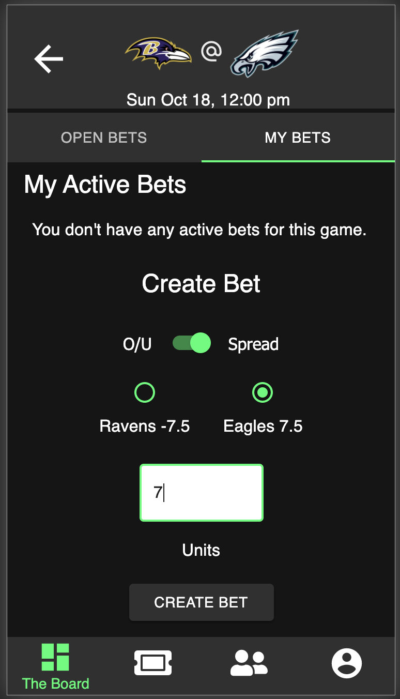

# Friendly Wager

_Project Duration: 2 Week Sprint_

'Friendly Wager' is a mobile app that allows you to create and accept bets on NFL games between you and your friends. There are two types of bets that you can make or accept from your friends - 1) the over/under and 2) the spread. This app uses two different APIs to automatically display the games for the current week, the betting odds, and calculate the winner of these bets.

Once logged in, the user is first brought to the main page, which we call 'The Board'. On 'The Board', the user will be able to see all of their friend's open bets (bets that have not been accepted by any users) and if they wish, accept any of these bets. If any open bet is accepted, this bet becomes an 'Active Bet', which cannot be accepted by any other users. 'The Board' also displays all games for the current week and gives the user the ability to make a new open bet that can be accepted by any of their friends.

The app also features a friends list feature where the user can see all of their current friends, as well as search for new friends by their name or email. Once the users are friends, they can access each other's 'Statistics' page to see any open bets that user has as well as statistical information such as their total bets. In each individual user's profile, they are also able to add a profile picture.

The user also has the capability to see all of their own 'Open Bets', 'Active Bets', and 'Historical Information' of bets they have won and lost. The historical information is calculated at the end of each week.

## Screenshots

<div>
  
  
  
</div>

## Prerequisites

Before you get started, make sure you have the following software installed on your computer:

- [Node.js](https://nodejs.org/en/)
- [PostrgeSQL](https://www.postgresql.org/)
- [Nodemon](https://nodemon.io/)

## Create database and table

Create a new database in postgreSQL called 'friendly_wager'. Once this is complete, run all the sql code in the database.sql file to build the initial structure of the database. This file includes tables for users, friends, games, teams, and bets.

If you would like to name your database something else, you will need to change 'friendly_wager' to the name of your new database name in 'server/modules/pool.js'.

## Creating the .ENV file

Create a `.env` file at the root of the project and paste this line into the file:
 ```
SERVER_SESSION_SECRET=**********************
CLIENT_ID=***********************
CLIENT_SECRET=**********************
ODDS_KEY=***********************
```
First you will need to establish a SERVER_SESSION_SECRET to keep your application secure. Here's a site that can help you generate a secret: https://passwordsgenerator.net/. NOTE This secret should be more than 8 characters. Having a secret key that is less than 8 characters or leaving it as "superDuperSecret" will result in a warning from the app.
  
DeWitt's instructions to obtaining NFL and odds keys.

## Installation

1. Run npm install
2. Start Postgres using brew services start postgresql
   (only required if PG is not already running)
3. Run npm run server
4. Run npm run client
5. Navigate to localhost:3000

## How to use Friendly Wager

